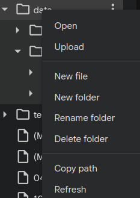
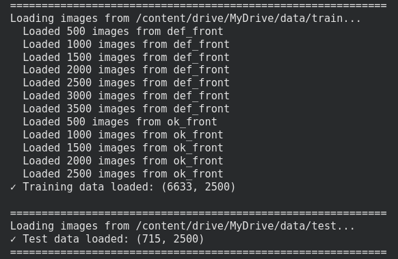

# Homework: Cast Manufactured Part Classification
## Comparing Logistic Regression and Neural Networks for Defect Detection

---

## Overview

This assignment uses a real-world dataset of submersible pump impeller images manufactured through casting. Your goal is to develop and compare classification algorithms to identify defective parts and automate the inspection process. This assignment integrates concepts from both our Logistic Regression session and Neural Networks session.


**Dataset Information:**
- You can download the data file for this assignment here: https://drive.google.com/file/d/1So50-C23iBe26m6Oo1K9dSetPv7zwlks/view?usp=sharing 
- Categories: Defective (`def_front`) and Non-defective (`ok_front`) parts
- Split: Training and Test sets provided
- Defect types include: blow holes, pinholes, burr, shrinkage defects, mould material defects, pouring metal defects, and metallurgical defects

---

## Part 0: Setup and Data Preparation

### Task 0.1: Import Required Libraries

```python
# Data manipulation
import pandas as pd
import numpy as np
import os
import cv2  # Install using: pip install opencv-python

# Visualization
import matplotlib.pyplot as plt
from matplotlib.image import imread
import seaborn as sns

# Traditional ML Models
from sklearn.linear_model import LogisticRegression
from sklearn.preprocessing import LabelEncoder, MinMaxScaler

# Evaluation metrics
from sklearn.metrics import (accuracy_score, f1_score, confusion_matrix, 
                             ConfusionMatrixDisplay, classification_report,
                             precision_score, recall_score, log_loss)

# Deep Learning
import tensorflow as tf
from tensorflow import keras
from tensorflow.keras import layers, models

# Set random seeds for reproducibility
np.random.seed(42)
tf.random.set_seed(42)

print(f"TensorFlow version: {tf.__version__}")
print(f"GPU Available: {tf.config.list_physical_devices('GPU')}")
```

---

### Task 0.2: Download and Organize Data

**Instructions:**
1. Download the zip file provided with this assignment
2. Unzip it to create a `data` folder with the following structure:
   ```
   data/
   ├── train/
   │   ├── def_front/    (defective parts)
   │   └── ok_front/     (non-defective parts)
   └── test/
       ├── def_front/    (defective parts)
       └── ok_front/     (non-defective parts)
   ```
**NOTE:** You need to place the folders with files on your google drive and then read them from there by connecting your notebook on Google Colab to your Google Drive. The process of uploading could take some time, depending on your internet connection.

3. **Update the BASE_PATH variable below** to point to your data folder location. For that, right click on your `data` folder in your notebook envrionment and select `Copy path` and then paste it as a string for the base path address.



```python
# TODO: Set the base path to your data folder
BASE_PATH =  # Modify this to match your directory structure
```

---

### Task 0.3: Understanding the Data - Visualize Sample Images

Let's look at examples of defective and non-defective parts to understand what we're working with.

```python
# Display sample images
files = ['def_front', 'ok_front']

# Get first image from each category
def_sample_path = os.path.join(BASE_PATH, 'train', 'def_front', 
                                os.listdir(os.path.join(BASE_PATH, 'train', 'def_front'))[0])
ok_sample_path = os.path.join(BASE_PATH, 'train', 'ok_front', 
                               os.listdir(os.path.join(BASE_PATH, 'train', 'ok_front'))[0])

# Create figure with two subplots
fig, axes = plt.subplots(1, 2, figsize=(12, 5))

# Defective sample
def_img = imread(def_sample_path)
axes[0].imshow(def_img, cmap='gray')
axes[0].set_title('Defective Part', fontsize=14, fontweight='bold')
axes[0].axis('off')

# Non-defective sample
ok_img = imread(ok_sample_path)
axes[1].imshow(ok_img, cmap='gray')
axes[1].set_title('Non-Defective Part', fontsize=14, fontweight='bold')
axes[1].axis('off')

plt.tight_layout()
plt.show()

print(f"Original image shape: {def_img.shape}")
```

**Question 1:** What differences do you observe between defective and non-defective parts? Are they visually obvious to you?

---

### Understanding Image Data and Preprocessing

Before we build our models, let's understand how image data needs to be processed:

**Key Concepts:**

1. **Grayscale Images**: Each pixel has a single intensity value (0-255), where 0 is black and 255 is white
2. **Image as Matrix**: A 300×300 grayscale image is a 300×300 matrix of numbers
3. **Feature Vector**: For machine learning, we flatten this 2D matrix into a 1D array (300×300 = 90,000 features!)
4. **Normalization**: We divide pixel values by 255 to scale them to [0, 1] range
5. **Resizing**: We resize all images to a consistent smaller size (e.g., 50×50) to reduce computation time

The preprocessing pipeline will:
- Load all images from the training and test folders
- Resize them to 50×50 pixels (you can experiment with different sizes)
- Convert them to grayscale
- Flatten them into 1D arrays (50×50 = 2,500 features per image)
- Normalize pixel values to [0, 1]

---

### Data Loading and Preprocessing Pipeline

Run the following cells to load and preprocess your data. **Read the comments carefully** to understand each step.

```python
# looking into dimensions (smaller = faster training, but may lose details)
WIDTH = 50   # Feel free to experiment: try 30, 50, 75, or 100
HEIGHT = 50

print(f"Images will be resized to {WIDTH}×{HEIGHT} pixels")
print(f"Each image will become a feature vector of length: {WIDTH * HEIGHT}")
```

---

#### Step 1: Load File Names

```python
def load_file_names(data_path, files):
    """
    Load image filenames into a dictionary organized by category
    
    Args:
        data_path: path to train or test folder
        files: list of category names ['def_front', 'ok_front']
    
    Returns:
        data_dict: dictionary with filenames for each category
    """
    data_dict = {f: [] for f in files}
    
    for category in files:
        category_path = os.path.join(data_path, category)
        
        # List all .jpeg files in the category folder
        for filename in os.listdir(category_path):
            if filename.endswith('.jpeg'):
                data_dict[category].append(filename)
    
    return data_dict

# Load training and test file names
data_train = load_file_names(os.path.join(BASE_PATH, 'train'), files)
data_test = load_file_names(os.path.join(BASE_PATH, 'test'), files)

print(f"Training set:")
print(f"  Defective parts: {len(data_train['def_front'])}")
print(f"  Non-defective parts: {len(data_train['ok_front'])}")
print(f"\nTest set:")
print(f"  Defective parts: {len(data_test['def_front'])}")
print(f"  Non-defective parts: {len(data_test['ok_front'])}")
```

---

#### Step 2: Visualize Data Distribution

```python
# distribution DataFrame
train_dist = pd.DataFrame({
    'Category': ['Defective', 'Non-Defective'],
    'Count': [len(data_train['def_front']), len(data_train['ok_front'])],
    'Split': ['Train', 'Train']
})

test_dist = pd.DataFrame({
    'Category': ['Defective', 'Non-Defective'],
    'Count': [len(data_test['def_front']), len(data_test['ok_front'])],
    'Split': ['Test', 'Test']
})

dist_df = pd.concat([train_dist, test_dist])

# grouped bar plot
fig, ax = plt.subplots(figsize=(10, 6))
x = np.arange(len(['Defective', 'Non-Defective']))
width = 0.35

train_counts = [len(data_train['def_front']), len(data_train['ok_front'])]
test_counts = [len(data_test['def_front']), len(data_test['ok_front'])]

ax.bar(x - width/2, train_counts, width, label='Train', alpha=0.8)
ax.bar(x + width/2, test_counts, width, label='Test', alpha=0.8)

ax.set_xlabel('Category', fontsize=12)
ax.set_ylabel('Number of Images', fontsize=12)
ax.set_title('Dataset Distribution', fontsize=14, fontweight='bold')
ax.set_xticks(x)
ax.set_xticklabels(['Defective', 'Non-Defective'])
ax.legend()
ax.grid(True, alpha=0.3, axis='y')

plt.tight_layout()
plt.show()
```

**Question 2:** Is the dataset balanced (approximately equal samples in each class)? How might class imbalance affect model performance? Do some online research about this issue and try to answer the question based on your search.

---

#### Step 3: Load and Preprocess Images (THIS CAN TAKE SOMETIME BETWEEN HALF AN HOUR TO AN HOUR!!)

```python
def load_images(data_path, data_dict, files, width, height):
    """
    Load and preprocess images:
    1. Read each image in grayscale
    2. Resize to specified dimensions
    3. Flatten to 1D array
    
    Args:
        data_path: path to train or test folder
        data_dict: dictionary with filenames
        files: list of category names
        width, height: target dimensions for resizing
    
    Returns:
        images: numpy array of flattened images (n_samples, width*height)
        labels: list of category labels for each image
    """
    images = []
    labels = []
    
    print(f"Loading images from {data_path}...")
    
    for category in files:
        category_path = os.path.join(data_path, category)
        
        for i, filename in enumerate(data_dict[category]):
            # reading image in grayscale (0 flag means grayscale)
            img_path = os.path.join(category_path, filename)
            img = cv2.imread(img_path, 0)
            
            # resizing images to target dimensions (as specified previouslys)
            img_resized = cv2.resize(img, (width, height))
            
            # flattening 2D image to 1D array
            img_flattened = img_resized.flatten()
            
            images.append(img_flattened)
            labels.append(category)
            
            # progress report
            if (i + 1) % 500 == 0:
                print(f"  Loaded {i + 1} images from {category}")
    
    return np.array(images), labels

# Load training data
print("="*60)
image_data_train, image_target_train = load_images(
    os.path.join(BASE_PATH, 'train'), data_train, files, WIDTH, HEIGHT
)
print(f"✓ Training data loaded: {image_data_train.shape}")

# Load test data
print("\n" + "="*60)
image_data_test, image_target_test = load_images(
    os.path.join(BASE_PATH, 'test'), data_test, files, WIDTH, HEIGHT
)
print(f"✓ Test data loaded: {image_data_test.shape}")
print("="*60)
```

**NOTE:** Once the loading is done, you should expect to see something like this as the output:


---

#### Step 4: Encode Labels

```python
# converting 'def_front' and 'ok_front' to numerical values (0 and 1)
labels_encoder = LabelEncoder()
labels_encoder.fit(image_target_train)

train_labels = labels_encoder.transform(image_target_train)
test_labels = labels_encoder.transform(image_target_test)

print(f"\nLabel encoding:")
print(f"  '{labels_encoder.classes_[0]}' → {labels_encoder.transform([labels_encoder.classes_[0]])[0]}")
print(f"  '{labels_encoder.classes_[1]}' → {labels_encoder.transform([labels_encoder.classes_[1]])[0]}")
print(f"\nTraining labels shape: {train_labels.shape}")
print(f"Test labels shape: {test_labels.shape}")
```

---

#### Step 5: Normalize Pixel Values

```python
# normalizing pixel values from [0, 255] to [0, 1]
# This helps models converge faster and perform better
train_images = image_data_train / 255.0
test_images = image_data_test / 255.0

print(f"\nNormalization complete:")
print(f"  Original pixel range: [0, 255]")
print(f"  Normalized range: [{train_images.min():.1f}, {train_images.max():.1f}]")
print(f"\nFinal data shapes:")
print(f"  Training: {train_images.shape} (samples × features)")
print(f"  Test: {test_images.shape} (samples × features)")
```

---

#### Step 6: Additional Scaling for Logistic Regression

```python
# For Logistic Regression, we apply additional MinMax scaling
# This ensures all features are in exactly the same [0, 1] range
# Neural networks work fine with just normalization, but this helps faster converging of the results

scaler = MinMaxScaler()
train_images_scaled = scaler.fit_transform(train_images)
test_images_scaled = scaler.transform(test_images)

print("\n" + "="*60)
print("DATA PREPROCESSING COMPLETE!")
print("="*60)
print(f"\nWe have two versions of the data:")
print(f"1. train_images / test_images → for Neural Networks")
print(f"2. train_images_scaled / test_images_scaled → for Logistic Regression")
print(f"\nEach image is now a vector of {train_images.shape[1]} features")
print(f"Ready to train models!")
print("="*60)
```

---

## Part 1: Logistic Regression

Now that the data is prepared, you'll build your first model. Use what you learned from the Logistic Regression lecture to complete the following tasks.

### Task 1.1: Build and Train Logistic Regression Model

```python
# TODO: Create Logistic Regression classifier
# Hint: Use LogisticRegression() with max_iter=1000
lr = # YOUR CODE HERE

# TODO: Train the model on scaled data
# Hint: use fit() method with train_images_scaled and train_labels
# YOUR CODE HERE

# TODO: Make predictions on training set
y_train_pred_lr = # YOUR CODE HERE

# TODO: Make predictions on test set
y_test_pred_lr = # YOUR CODE HERE

# TODO: Get probability predictions for test set
# Hint: use predict_proba() method
y_test_pred_proba_lr = # YOUR CODE HERE

print("✓ Logistic Regression model trained successfully!")
```

---

### Task 1.2: Examine Probability Predictions

```python
# Display first 10 probability predictions
print("\n" + "="*60)
print("SAMPLE PROBABILITY PREDICTIONS")
print("="*60)
print("Format: [P(class=0), P(class=1)]\n")

for i in range(10):
    actual = test_labels[i]
    predicted = y_test_pred_lr[i]
    proba = y_test_pred_proba_lr[i]
    
    # Determine if prediction is correct
    status = "✓" if actual == predicted else "✗"
    
    print(f"Sample {i:2d} {status}: Actual={actual}, Predicted={predicted}, "
          f"P(class 0)={proba[0]:.3f}, P(class 1)={proba[1]:.3f}")
```

**Question 3:** How confident is the Logistic Regression model in its predictions? Do you see any cases where the model is uncertain (probabilities close to 0.5)?

---

### Task 1.3: Evaluate Logistic Regression Model

```python
# TODO: Calculate accuracy for training set
acc_train_lr = # YOUR CODE HERE

# TODO: Calculate F1-score for training set
f1_train_lr = # YOUR CODE HERE

print("\n" + "="*60)
print("LOGISTIC REGRESSION - TRAINING SET PERFORMANCE")
print("="*60)
print(f"Accuracy:  {acc_train_lr:.4f}")
print(f"F1-Score:  {f1_train_lr:.4f}")

print("\n" + "="*60)
print("LOGISTIC REGRESSION - TEST SET PERFORMANCE")
print("="*60)

# TODO: Calculate accuracy for test set
acc_test_lr = # YOUR CODE HERE

# TODO: Calculate F1-score for test set
f1_test_lr = # YOUR CODE HERE

# TODO: Calculate log loss for test set
# Hint: use log_loss() with test_labels and y_test_pred_proba_lr
log_loss_lr = # YOUR CODE HERE

print(f"Accuracy:  {acc_test_lr:.4f}")
print(f"F1-Score:  {f1_test_lr:.4f}")
print(f"Log Loss:  {log_loss_lr:.4f}")
print("="*60)
```

**Question 4:** Is there a significant difference between training and test performance? What does this tell you about overfitting or underfitting?

---

### Task 1.4: Logistic Regression Confusion Matrix

```python
# TODO: Create confusion matrix
# Hint: use confusion_matrix() with test_labels and y_test_pred_lr
cm_lr = # YOUR CODE HERE

# Display confusion matrix
disp_lr = ConfusionMatrixDisplay(
    confusion_matrix=cm_lr,
    display_labels=['Defective', 'Non-Defective']
)
disp_lr.plot(cmap='Blues', values_format='d')
plt.title('Logistic Regression Confusion Matrix (Test Set)', 
          fontsize=14, fontweight='bold')
plt.tight_layout()
plt.show()
```

**Question 5:** Looking at the confusion matrix:
- How many defective parts were correctly identified?
- How many defective parts were missed (false negatives)?
- How many good parts were incorrectly flagged as defective (false positives)?
- In manufacturing, which type of error is more costly?

---

## Part 2: Neural Networks - Shallow Network

Now you'll build a shallow neural network (one hidden layer) using what you learned in the Neural Networks lecture.

### Task 2.1: Build a Shallow Neural Network

Build a shallow neural network with the following architecture:
- **Input layer**: Takes images with shape (WIDTH × HEIGHT,)
- **Hidden layer**: 350 units with ReLU activation
- **Output layer**: 1 unit with Sigmoid activation

```python
# TODO: Create a Sequential model for shallow network
# Architecture: Input → Dense(350, relu) → Dense(1, sigmoid)
# Hint: Review the lecture code for build_shallow_network()
shallow_model = # YOUR CODE HERE

# Display architecture
print("\n" + "="*70)
print("SHALLOW NETWORK ARCHITECTURE")
print("="*70)
shallow_model.summary()
```

---

### Task 2.2: Compile and Train Shallow Network

```python
# TODO: Compile the model
# Use optimizer='adam', loss='binary_crossentropy', metrics=['accuracy']
# YOUR CODE HERE

print("\n" + "="*70)
print("TRAINING SHALLOW NETWORK")
print("="*70)

# TODO: Train the model
# Use 50 epochs, batch_size=64
# Use validation_data=(test_images, test_labels)
# Save the history in a variable called 'shallow_history'
shallow_history = # YOUR CODE HERE

print("\n✓ Shallow network training completed!")
```

**IMPORTANT NOTE:** If you want to re-run this step, don't just run the training step. You need to recreate the model `shallow_model` using Task 2.1 and then train the model in Task 2.2.

---

### Task 2.3: Visualize Shallow Network Training

```python
# TODO: Plot training history
# Create a figure with 2 subplots (1 row, 2 columns)
# Left plot: Training and Validation Loss
# Right plot: Training and Validation Accuracy
# Hint: Review the lecture code for plotting training history

# YOUR CODE HERE
```

Print the final results:

```python
final_train_loss = shallow_history.history['loss'][-1]
final_val_loss = shallow_history.history['val_loss'][-1]
final_train_acc = shallow_history.history['accuracy'][-1]
final_val_acc = shallow_history.history['val_accuracy'][-1]

print("\n" + "="*60)
print("SHALLOW NETWORK - FINAL RESULTS")
print("="*60)
print(f"Training Loss:      {final_train_loss:.4f}")
print(f"Validation Loss:    {final_val_loss:.4f}")
print(f"Training Accuracy:  {final_train_acc:.4f}")
print(f"Validation Accuracy: {final_val_acc:.4f}")
print("="*60)
```

**Question 6:** Examine the training curves:
- Do the training and validation curves converge or diverge?
- Is there evidence of overfitting (training continues to improve while validation plateaus or worsens)?
- At what epoch does the model seem to reach its best performance?

---

### Task 2.4: Evaluate Shallow Network

```python
# Make predictions (threshold at 0.5)
y_test_pred_shallow_proba = shallow_model.predict(test_images)
y_test_pred_shallow = (y_test_pred_shallow_proba > 0.5).astype(int).flatten()

# TODO: Calculate accuracy
acc_test_shallow = # YOUR CODE HERE

# TODO: Calculate F1-score
f1_test_shallow = # YOUR CODE HERE

print("\n" + "="*60)
print("SHALLOW NETWORK - TEST SET PERFORMANCE")
print("="*60)
print(f"Accuracy:  {acc_test_shallow:.4f}")
print(f"F1-Score:  {f1_test_shallow:.4f}")
print("="*60)

# TODO: Create confusion matrix
cm_shallow = # YOUR CODE HERE

# TODO: Display confusion matrix with title 'Shallow Network Confusion Matrix (Test Set)'
# Use colormap 'Purples'
# YOUR CODE HERE
```

---

## Part 3: Neural Networks - Deep Network

Now you'll build a deeper network with multiple hidden layers.

### Task 3.1: Build a Deep Neural Network

Build a deep neural network with the following architecture:
- **Input layer**: Takes images with shape (WIDTH × HEIGHT,)
- **Hidden layer 1**: 128 units with ReLU activation
- **Hidden layer 2**: 64 units with ReLU activation
- **Hidden layer 3**: 32 units with ReLU activation
- **Output layer**: 1 unit with Sigmoid activation

```python
# TODO: Create a Sequential model for deep network
# Architecture: Input → Dense(128, relu) → Dense(64, relu) → Dense(32, relu) → Dense(1, sigmoid)
# Hint: Review the lecture code for build_deep_network()
deep_model = # YOUR CODE HERE

print("\n" + "="*70)
print("DEEP NETWORK ARCHITECTURE")
print("="*70)
deep_model.summary()
```

---

### Task 3.2: Compile and Train Deep Network

```python
# TODO: Compile the model
# Use optimizer='adam', loss='binary_crossentropy', metrics=['accuracy']
# YOUR CODE HERE

print("\n" + "="*70)
print("TRAINING DEEP NETWORK")
print("="*70)

# TODO: Train the model
# Use 50 epochs, batch_size=64
# Use validation_data=(test_images, test_labels)
# Save the history in a variable called 'deep_history'
deep_history = # YOUR CODE HERE

print("\n✓ Deep network training completed!")
```

**IMPORTANT NOTE:** If you want to re-run this step, don't just run the training step. You need to recreate the model `deep_model` using Task 3.1 and then train the model in Task 3.2.

---

### Task 3.3: Visualize Deep Network Training

```python
# TODO: Plot training history for deep network
# Create a figure with 2 subplots showing Loss and Accuracy curves
# YOUR CODE HERE
```

Print the final results:

```python
final_train_loss = deep_history.history['loss'][-1]
final_val_loss = deep_history.history['val_loss'][-1]
final_train_acc = deep_history.history['accuracy'][-1]
final_val_acc = deep_history.history['val_accuracy'][-1]

print("\n" + "="*60)
print("DEEP NETWORK - FINAL RESULTS")
print("="*60)
print(f"Training Loss:      {final_train_loss:.4f}")
print(f"Validation Loss:    {final_val_loss:.4f}")
print(f"Training Accuracy:  {final_train_acc:.4f}")
print(f"Validation Accuracy: {final_val_acc:.4f}")
print("="*60)
```


**Question 7:** Compare the training curves of the deep network to the shallow network:
- Which network converges faster?
- Which shows better final performance?
- Do you see any evidence of overfitting in either network?

---

### Task 3.4: Evaluate Deep Network

```python
# Make predictions
y_test_pred_deep_proba = deep_model.predict(test_images)
y_test_pred_deep = (y_test_pred_deep_proba > 0.5).astype(int).flatten()

# TODO: Calculate accuracy
acc_test_deep = # YOUR CODE HERE

# TODO: Calculate F1-score
f1_test_deep = # YOUR CODE HERE

print("\n" + "="*60)
print("DEEP NETWORK - TEST SET PERFORMANCE")
print("="*60)
print(f"Accuracy:  {acc_test_deep:.4f}")
print(f"F1-Score:  {f1_test_deep:.4f}")
print("="*60)

# TODO: Create confusion matrix
cm_deep = # YOUR CODE HERE

# TODO: Display confusion matrix with title 'Deep Network Confusion Matrix (Test Set)'
# Use colormap 'Oranges'
# YOUR CODE HERE
```

---

## Part 4: Comprehensive Model Comparison

### Task 4.1: Compare All Three Models

```python
# Create comparison DataFrame
comparison = pd.DataFrame({
    'Model': ['Logistic Regression', 'Shallow NN (1 layer)', 'Deep NN (3 layers)'],
    'Accuracy': [acc_test_lr, acc_test_shallow, acc_test_deep],
    'F1-Score': [f1_test_lr, f1_test_shallow, f1_test_deep],
    'Parameters': [
        'N/A',
        shallow_model.count_params(),
        deep_model.count_params()
    ]
})

print("\n" + "="*70)
print("FINAL MODEL COMPARISON (Test Set)")
print("="*70)
print(comparison.to_string(index=False))
print("="*70)

# TODO: Create a bar plot comparing Accuracy and F1-Score for all three models
# YOUR CODE HERE
```

---

### Task 4.2: Side-by-Side Confusion Matrices

```python
# TODO: Create a figure with 3 subplots (1 row, 3 columns)
# Display confusion matrices for Logistic Regression, Shallow NN, and Deep NN
# Use different colormaps for each: 'Blues', 'Purples', 'Oranges'
# YOUR CODE HERE
```

---

### Task 4.3: Precision and Recall Analysis

```python
models_predictions = {
    'Logistic Regression': y_test_pred_lr,
    'Shallow NN': y_test_pred_shallow,
    'Deep NN': y_test_pred_deep
}

print("\n" + "="*70)
print("PRECISION AND RECALL COMPARISON")
print("="*70)
print("\nReminder:")
print("  Precision = Of predicted defects, how many were actually defective?")
print("  Recall = Of actual defects, how many did we catch?")
print("="*70 + "\n")

precision_recall_df = pd.DataFrame()

for model_name, predictions in models_predictions.items():
    # TODO: Calculate precision for each model
    precision = # YOUR CODE HERE
    
    # TODO: Calculate recall for each model
    recall = # YOUR CODE HERE
    
    print(f"{model_name}:")
    print(f"  Precision: {precision:.4f}")
    print(f"  Recall:    {recall:.4f}")
    print()
    
    precision_recall_df = pd.concat([precision_recall_df, pd.DataFrame({
        'Model': [model_name],
        'Precision': [precision],
        'Recall': [recall]
    })], ignore_index=True)

# TODO: Create a grouped bar plot comparing Precision and Recall for all models
# YOUR CODE HERE
```

**Question 8:** 
- Which model has the highest precision?
- Which model has the highest recall?
- In a manufacturing context, if a defective part makes it through inspection, it could fail in use (potentially causing safety issues or expensive warranty claims). On the other hand, falsely marking good parts as defective wastes material and time. Given this context, which metric (precision or recall) is more important? Which model would you choose?

---

## Part 5: Analysis and Reflection

### Question 10: Overall Performance
Based on accuracy, F1-score, precision, and recall, which model performed best overall? Was the improvement of deep learning over logistic regression significant enough to justify the added complexity?

---

### Question 11: Overfitting Analysis
Looking at the training curves for both neural networks:
- Did either network show signs of overfitting?
- If you had to train these models for longer (e.g., 500 epochs instead of 50), what do you think would happen?

---

### Question 12: Shallow vs Deep Networks
The deep network has more layers and parameters than the shallow network:
- Did the deep network significantly outperform the shallow network?
- What are the trade-offs between using shallow vs deep architectures for this problem?
- When might a deeper network be more beneficial?

---

### Question 13: Model Complexity and Parameters
Compare the number of parameters across models:
- Which model has the most parameters?
- Does more parameters always mean better performance?
- What are the disadvantages of having too many parameters?

---

### Question 14: Real-World Deployment
Imagine you need to deploy one of these models in an actual manufacturing facility for real-time defect inspection:
- Which model would you choose and why?
- Consider: accuracy, inference speed, interpretability, ease of updating, computational requirements
- What additional considerations would be important for deployment? (e.g., handling new types of defects, false alarm rates, inspection speed requirements)

---

### Question 15: Error Analysis
Look at the confusion matrices for all three models:
- Which model makes the fewest false negatives (missing actual defects)?
- Which model makes the fewest false positives (false alarms)?
- If you could only reduce one type of error, which would you choose for this application and why?

---

## Part 6: Optimizer Comparison (Optional Bonus)

Following what you learned in the lecture about different optimizers, compare their performance on the shallow network.

### Bonus Task: Compare Different Optimizers

```python
# different optimizers from the lecture
optimizers_to_test = {
    'SGD': keras.optimizers.SGD(learning_rate=0.01),
    'SGD + Momentum': keras.optimizers.SGD(learning_rate=0.01, momentum=0.9),
    'RMSprop': keras.optimizers.RMSprop(learning_rate=0.001),
    'Adam': keras.optimizers.Adam(learning_rate=0.001)
}

results = {}

for optimizer_name, optimizer in optimizers_to_test.items():
    print(f"\nTraining with {optimizer_name}...")
    
    # TODO: Build new shallow network
    model_test = # YOUR CODE HERE
    
    # TODO: Compile with the current optimizer
    # YOUR CODE HERE
    
    # TODO: Train for 50 epochs
    history = # YOUR CODE HERE
    
    results[optimizer_name] = history.history

# TODO: Create comparison plots showing training loss and validation accuracy
# for all four optimizers
# YOUR CODE HERE
```

**Bonus Question:** Which optimizer performed best? Why do you think Adam is often the default choice for deep learning?

---

## Submission Requirements

**Submit a Jupyter notebook** named `LastName_FirstName_Casting_Defect.ipynb` containing:

### Required Elements:
1. All code cells executed with visible outputs
2. All visualizations (sample images, confusion matrices, training curves, comparison plots)
3. Answers to **all 15 questions** in text (markdown) cells (clearly labeled)
4. Model comparison summary table
5. Brief conclusion (2-3 paragraphs) discussing:
   - Which model you would recommend for deployment
   - Key insights learned from comparing traditional ML vs neural networks
   - Most important considerations for this manufacturing application
