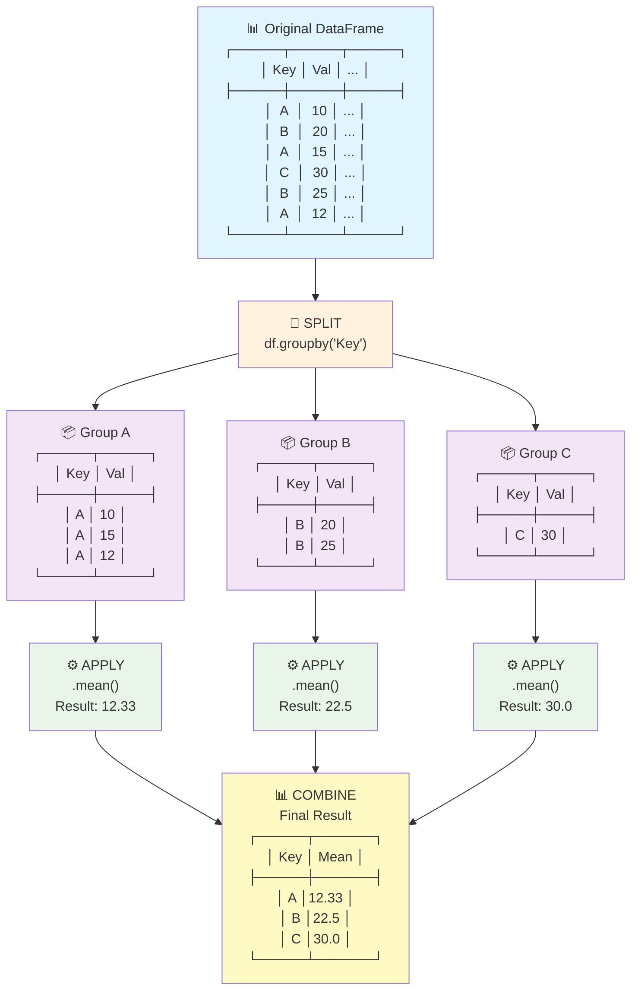

# NumPy and Pandas Essentials for Data Analysis

## Learning Objectives
By the end of this module, you will be able to:
- Use NumPy arrays for efficient numerical calculations
- Load and manipulate data with pandas DataFrames
- Perform basic data cleaning and filtering
- Calculate summary statistics on datasets

---

## 📝 IN-CLASS ASSIGNMENT Setup

**Create a new Jupyter notebook** named `your_name_numpy_pandas.ipynb`

You will complete exercises throughout this lesson in your notebook. Each exercise should be completed before moving to the next section.

---

## NumPy Essentials

### What is NumPy?
NumPy is Python's numerical computing library - it's much faster than regular Python lists for mathematical operations.

### Creating Arrays

```python
import numpy as np

# converting python lists to arrays
temperatures = [22.1, 23.5, 24.2, 23.8]
temp_array = np.array(temperatures)

# making arrays directly
zeros = np.zeros(5)                    # [0, 0, 0, 0, 0]
ones = np.ones(3)                      # [1, 1, 1]
range_vals = np.arange(0, 10, 2)       # [0, 2, 4, 6, 8]
evenly_spaced = np.linspace(0, 100, 5) # [0, 25, 50, 75, 100]

# Random data - good for simulations
random_temps = np.random.normal(25, 3, 10)  # 10 temps, mean=25, std=3
```

### 📝 Exercise 1: NumPy Array Creation
**Complete this in your notebook before proceeding**

1. Import NumPy and create the following arrays:
   - `pressures`: Convert this Python list to a NumPy array: `[1013.2, 1012.8, 1014.1, 1013.7, 1012.5]`
   - `empty_readings`: Create an array of 8 zeros
   - `temp_range`: Create an array with values from 10 to 50 in steps of 5 using `np.arange()`
   - `humidity_levels`: Generate 6 evenly spaced values between 0 and 30 using `np.linspace()`

2. Print each array and verify they were created correctly

---

### Array Operations

```python
# doing math on arrays
celsius = np.array([20, 25, 30])
fahrenheit = celsius * 9/5 + 32       # converting all at once
kelvin = celsius + 273.15

# getting basic stats
print(f"Average: {np.mean(celsius)}")
print(f"Standard deviation: {np.std(celsius)}")
print(f"Maximum: {np.max(celsius)}")
```

### 📝 Exercise 2: Array Operations and Statistics
**Complete this in your notebook before proceeding**

Using the `pressures` array from Exercise 1:
1. Convert all pressure values from hPa to Pa (multiply by 100)
2. Calculate and print the mean, standard deviation, minimum, and maximum pressure
3. Create a boolean array showing which pressures are above the mean
4. Calculate the range (max - min) of the pressures

---

### Multi-dimensional Arrays

```python
# 2d array
sensor_data = np.array([
    [22.1, 65.3, 1013.2],  # Day 1: temp, humidity, pressure
    [23.5, 63.1, 1012.8],  # day 2
    [24.8, 61.7, 1014.1]   # Day 3
])

# Getting the number of rows and columns
print(sensor_data.shape)

# getting data out
all_temps = sensor_data[:, 0]      # all temperatures (first column)
day_2 = sensor_data[1, :]          # All sensors for day 2
temp_day_1 = sensor_data[0, 0]     # temperature on day 1

# max calculations per row and per columns
print(np.max(sensor_data, axis=1))
print(np.max(sensor_data, axis=0))
```

### 📝 Exercise 3: Working with 2D Arrays
**Complete this in your notebook before proceeding**

1. Create a 2D array called `weekly_data` with 7 rows (days) and 3 columns (temperature, humidity, pressure):
   ```
   Day 1: [21.5, 68.2, 1013.5]
   Day 2: [22.8, 65.1, 1012.9]
   Day 3: [24.1, 63.7, 1014.2]
   Day 4: [23.3, 66.8, 1013.1]
   Day 5: [25.2, 61.9, 1015.0]
   Day 6: [26.1, 60.3, 1014.7]
   Day 7: [24.9, 62.5, 1013.8]
   ```

2. Extract and analyze the data:
   - Extract all temperatures for the week 
   - Get all sensor readings for day 4
   - Calculate the average temperature, humidity, and pressure for the week
   - Find which day had the highest temperature

---

## Pandas Essentials

### What is Pandas?
Pandas is built on NumPy but designed for working with real-world data - think Excel, but much more powerful.

### DataFrames - Your Data Tables

```python
import pandas as pd

# Creating a DataFrame from dictionary 
sensor_data = {
    'timestamp': ['2024-01-01 08:00', '2024-01-01 09:00', '2024-01-01 10:00'],
    'temperature': [22.1, 23.5, 24.2],
    'humidity': [65.3, 63.1, 61.7],
    'sensor_id': ['A001', 'A001', 'A001']
}

df = pd.DataFrame(sensor_data)
print(df)

# looking at data types
print(df.dtypes)
```

### 📝 Exercise 4: Creating Your First DataFrame
**Complete this in your notebook before proceeding**

1. Import pandas and create a DataFrame called `weather_df` with these columns and data:
   - `time`: ['09:00', '10:00', '11:00', '12:00', '13:00']
   - `temperature`: [18.5, 20.1, 22.3, 24.7, 23.8]
   - `humidity`: [72.1, 69.5, 66.8, 63.2, 65.1]
   - `wind_speed`: [5.2, 6.1, 7.3, 8.9, 7.7]

2. Explore your DataFrame:
   - Display the DataFrame
   - Print the column names
   - Print the shape of the DataFrame
   - Show the data types of each column

---

### Loading Data

Accessing data is a necessary first step for data analysis. We always use __Pandas__ for importing and exporting data thorough this course. In programming language, they refere to reading data from a file as _parsing_.

When you do data analysis, you mainly have to import/ export/ deal with one of the following type of data:

- Text files and other more efficient on-disk formats scuh as CSV files, Excel files, HTML files, GeoJSON files, etc
- Loading data from databases
- Interacting with network sources like web APIs

We will mainly focus on CSV and Excel files since they are the most common type of data types for small datasets.

#### CSV file

This is the data set for the experiments done by NASA on a series of airfoils to measure the noise generated due to the fluid-solid interaction in a wind tunnel. This data set is a CSV file and it is located at https://raw.githubusercontent.com/MasoudMiM/ME_364/main/Airfoil_noise/Airfoil_Noise.csv. The file has no header to describe the values in each column but the description of the data is given here: https://raw.githubusercontent.com/MasoudMiM/ME_364/main/Airfoil_noise/READ_ME.

Therefore, we know that the first five columns are:
1. Frequency, in Hertzs. 
2. Angle of attack, in degrees. 
3. Chord length, in meters. 
4. Free-stream velocity, in meters per second. 
5. Suction side displacement thickness, in meters. 

and the last column is:
6. Scaled sound pressure level, in decibels. 

So we use options <font color='green'>header</font> for <font color='blue'>read_csv</font> command to mention that the file has no header and <font color='green'>names</font> to provide names fo the columns for the data set:

```python
url = 'https://raw.githubusercontent.com/MasoudMiM/ME_364/main/Airfoil_noise/Airfoil_Noise.csv'   # link to the Airfoil Noise data set
df = pd.read_csv(url,header=None, names=['Frequency (Hz)','Attack_Angle (deg)','Cord (m)','FS_Velocity (m/s)','SSD_Thickness (m)','Sound_Pressure_Level (dB)'])

# dataset is now stored in a pandas Dataframe
df.head() # looking at the first five rows
```

#### Excel file

The second data set is fuel economy data which are the result of vehicle testing done at the Environmental Protection Agency's National Vehicle and Fuel Emissions Laboratory in Ann Arbor, Michigan, and by vehicle manufacturers with oversight by EPA. The data file is an Excel file and it is located at https://raw.githubusercontent.com/MasoudMiM/ME_364/main/EPA_Green_Vehicle_Guide/Data.xlsx. You can also find a very good description of the data here: https://github.com/MasoudMiM/ME_364/blob/main/EPA_Green_Vehicle_Guide/Data_Description.pdf


The is an Excel file so we need to first give the address to the file using <font color='blue'>ExcelFile</font> and then import the specific sheet from the file using the command <font color='blue'>read_excel</font>

```python
xlsx = pd.ExcelFile('https://raw.githubusercontent.com/MasoudMiM/ME_364/main/EPA_Green_Vehicle_Guide/Data.xlsx')
df2 = pd.read_excel(xlsx, 'Sheet1')            # first sheet of the Excel file

# Dataset is now stored in a pandas Dataframe
df2
```

### Exploring Your Data

```python
# looking at the dataframe
print(df.head())        # first 5 rows
print(df.tail())        # Last 5 rows
print(df.info())        # data types and missing values
print(df.describe())    # Summary statistics

print(f"Shape: {df.shape}")              # (rows, columns)
print(f"Columns: {df.columns.tolist()}")  # column names
```

### 📝 Exercise 5: Loading and Exploring Real Data
**Complete this in your notebook before proceeding**

1. Load the NASA airfoil dataset using the code from the lecture notes above
2. Explore the dataset:
   - Display the first 10 rows
   - Show the last 5 rows
   - Get basic information about the dataset (shape, data types)
   - Calculate basic statistics for all numerical columns

**Optional:** Also try loading the EPA dataset and explore its structure

---

### Selecting Data

```python
freqs = df['Frequency (Hz)']           # single column (Series)
frqs_attack = df[['Frequency (Hz)','Attack_Angle (deg)']]  # Multiple columns (dataframe)

# selecting rows
first_row = df.iloc[0]             # by position
first_three = df.iloc[0:3]         # first 3 rows

# filtering data
high_frq = df[df['Frequency (Hz)'] > 1000]           # conditional filtering

# combining conditions with & (and) and | (or)
complex_filter = df[(df['Frequency (Hz)'] > 5000) & (df['Sound_Pressure_Level (dB)'] > 135)]
print(complex_filter)

# counting filtered results
count_high_freq = len(df[df['Frequency (Hz)'] > 5000])
```

### 📝 Exercise 6: Data Selection and Filtering
**Complete this in your notebook before proceeding**

Using the airfoil dataset you loaded in Exercise 5:
1. Extract just the 'Sound_Pressure_Level (dB)' column as a Series
2. Select both 'Frequency (Hz)' and 'Sound_Pressure_Level (dB)' columns as a DataFrame
3. Get rows 5 through 10 (inclusive) using iloc
4. Filter the data to show only rows where frequency is greater than 2000 Hz
5. Find rows where both frequency > 1000 Hz AND sound pressure level > 125 dB (use the `&` operator)
6. Count how many rows meet the criteria in step 5 (hint: use `len()` on the filtered DataFrame)

---

### Data Cleaning

```python
# sample dataset with data quality issues
messy_data = {
    'timestamp': ['2024-01-01 08:00', '2024-01-01 09:00', '2024-01-01 10:00', 
                  '2024-01-01 11:00', '2024-01-01 12:00', '2024-01-01 09:00'],  
    'temperature': [22.1, 'error', 24.2, None, 23.8, 23.5],  
    'humidity': [65.3, 63.1, None, 68.2, 64.5, 63.1],        
    'sensor_id': ['A001', 'A002', 'A001', 'A003', 'A001', 'A002']
}
df_messy = pd.DataFrame(messy_data)
print("original messy data:")
print(df_messy)
print(f"Data types:\n{df_messy.dtypes}")

# data quality issues 
# -- reporting missing values
print("missing values:")
print(df_messy.isnull().sum())

# cleaning steps
# 1. convert temperature to numeric (errors become NaN)
df_messy['temperature'] = pd.to_numeric(df_messy['temperature'], errors='coerce')

# 2. Convert timestamp to datetime
df_messy['timestamp'] = pd.to_datetime(df_messy['timestamp'])

# 3. fill missing values
humidity_mean = df_messy['humidity'].mean()
df_messy['humidity'] = df_messy['humidity'].fillna(humidity_mean)

# 4. remove rows with missing temperature
clean_df = df_messy.dropna(subset=['temperature'])

# 5. Remove duplicates
clean_df = clean_df.drop_duplicates()

print("cleaned data:")
print(clean_df)
```

### 📝 Exercise 7: Data Cleaning Challenge
**Complete this in your notebook before proceeding**

1. Create a new messy dataset using the following dictionary:
    ```python
    sensor_readings = {
        'date': ['2024-03-15', '2024-03-16', '2024-03-17', '2024-03-18', '2024-03-19', '2024-03-20', '2024-03-21', '2024-03-16'],
        'pressure': [1013.2, 'sensor_fault', 1015.8, 1012.4, None, 1014.1, 1013.7, 1015.8],
        'wind_speed': [12.5, 8.3, None, 15.7, 'calibrating', 9.2, 11.8, 8.3],
        'location': ['Station_A', 'Station_B', 'Station_A', 'Station_C', 'Station_A', 'station_b', 'Station_C', 'Station_B'],
        'battery_level': [89, 76, 82, None, 45, 'low', 91, 76]
    }
    ```
2. Identify all the data quality issues in the dataset:
   - Print the data types using `.dtypes`
   - Count missing values in each column using `.isnull().sum()`

3. Clean the data step by step:
   - Convert the pressure column to numeric
   - Convert the wind_speed column to numeric
   - Convert the battery_level column to numeric
   - Convert date to datetime format
   - Fill missing pressure values with the column mean 
   - Fill missing wind_speed values with the column mean 
   - Fill missing battery_level values with the column mean 
   - Standardize the location column by converting all to title case using `.str.title()`
   - Remove duplicate rows using `.drop_duplicates()`

4. Compare the shape before and after cleaning using `.shape` and report what was removed

---

### Basic Statistics and Grouping

```python

sample_data = {
    'Frequency (Hz)': [500, 800, 1200, 1500, 2000, 2500, 1000, 1800, 2200, 600, 
                       900, 1300, 1600, 2100, 2600, 1100, 1900, 2300, 700, 950],
    'Attack_Angle (deg)': [0, 0, 5, 5, 10, 10, 15, 15, 0, 0,
                          5, 5, 10, 10, 15, 15, 0, 5, 10, 15],
    'Sound_Pressure_Level (dB)': [115.2, 118.5, 122.1, 125.8, 129.3, 132.7, 126.9, 130.4, 
                                  133.1, 116.8, 119.7, 123.4, 127.2, 130.8, 134.2, 
                                  128.5, 131.9, 124.6, 128.1, 127.3],
    'temperature': [22.1, 22.5, 23.2, 23.8, 24.1, 24.5, 23.6, 24.2, 
                   24.8, 22.3, 22.9, 23.5, 24.0, 24.3, 24.7, 23.9, 
                   24.4, 23.7, 23.1, 23.4],
    'sensor_id': ['A001', 'A002', 'A001', 'A003', 'A002', 'A001', 'A003', 'A002',
                  'A001', 'A003', 'A002', 'A001', 'A003', 'A002', 'A001', 'A003',
                  'A002', 'A001', 'A003', 'A002']
}
df = pd.DataFrame(sample_data)

# summary statistics for individual columns
print("temperature statistics:")
print(f"Mean: {df['temperature'].mean()}")
print(f"median: {df['temperature'].median()}")
print(f"Standard deviation: {df['temperature'].std()}")

# overall statistics for all columns
print(df.describe())

# correlation between columns
correlation = df['Frequency (Hz)'].corr(df['Sound_Pressure_Level (dB)'])
print(f"correlation: {correlation}")

# finding the maximum per group
max_group = df.groupby('Attack_Angle (deg)')['Sound_Pressure_Level (dB)'].mean().idxmax()
print(f"Attack angle with highest average sound level: {max_group}")

# finding the group with maximum average
max_group = df.groupby('Attack_Angle (deg)')['Sound_Pressure_Level (dB)'].mean().idxmax()
print(f"Attack angle with highest average sound level: {max_group}")

# grouping by categories and calculating multiple statistics for each group
sensor_stats = df.groupby('sensor_id')['temperature'].agg(['mean', 'std', 'count'])
print(sensor_stats)

# multiple aggregations for each group
freq_summary = df.groupby('Attack_Angle (deg)')['Frequency (Hz)'].agg(['min', 'max', 'mean'])
print(freq_summary)
```

**NOTE:** "groupby" follows a `SPLIT-APPLY-COMBINE` approach.

- 🔄 **SPLIT**
    - Divides DataFrame into groups based on unique values in grouping column(s)
    - Each group contains all rows with the same key value

- ⚙️ **APPLY** 
    - Applies the same function to each group independently
    - Common functions: `.mean()`, `.sum()`, `.count()`, `.std()`, `.agg()`

- 📊 **COMBINE**
    - Merges results from all groups back into a single DataFrame
    - Grouping column becomes the index or stays as a column




### 📝 Exercise 8: Statistical Analysis with Real Data
**Complete this in your notebook before proceeding**

Using the airfoil dataset from Exercise 5:
1. Calculate the mean, median, and standard deviation for 'Sound_Pressure_Level (dB)'
2. Find the correlation between 'Frequency (Hz)' and 'Sound_Pressure_Level (dB)' 
3. Group the data by 'Attack_Angle (deg)' and calculate:
   - Mean frequency for each attack angle using `.agg(['mean'])`
   - Mean sound pressure level for each attack angle
   - Count of measurements for each attack angle using `.agg(['count'])`
4. Which attack angle has the highest average sound pressure level? (use `.idxmax()` on the grouped means)
5. Create a summary showing the minimum and maximum frequency for each attack angle

---

## Submission Instructions

**Submit your completed Jupyter notebook** (`your_name_numpy_pandas.ipynb`). Make sure your notebook includes:

- Clear section headers for each exercise
- Well-commented code explaining your approach
- Output from running each code cell

**Note:** Complete each exercise before moving to the next section. This progressive approach will help you build understanding step by step.